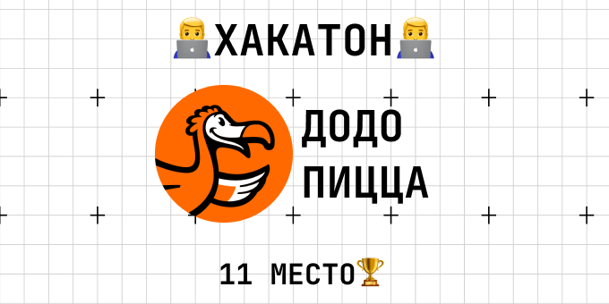

---

##### Ссылки

+ [Офф сайт](https://datasecrets.ru/hackathons/7)
+ [Исходник](https://github.com/Qwest1204/DODO-hackaton)

---

#### Задача
Dodo Pizza дважды в неделю рассылает миллионам пользователей персональные промокоды. Не все их применяют, и компания хотела понять:
для какого конкретного клиента и конкретного промокода вероятность применения максимальна.
Это классическая задача бинарной классификации на уровне «клиент × промокод»: предсказать, использует ли клиент полученную в октябре/ноябре 2023 промоакцию (target = 1/0).

#### Основные сложности

* Сильный дисбаланс классов (~6–8 % положительных примеров).
* Очень высокая размерность и разреженность признаков (сотни тысяч клиентов, миллионы строк в логе мобильных событий).
* Необходимость построения признаков из трёх разнородных источников: история заказов, параметры самих промокодов (сумма заказа, размер скидки, тип доставки и т.д.) и мобильные события.

#### Как я решил задачу

* Агрегация истории заказов по клиенту
* средняя/суммарная скидка, средний чек, количество заказов, доля доставки/самовывоза, доля применённых ранее промокодов, средняя корзина по категориям и т.д.
* добавил «жёсткие» признаки: использовал ли клиент промокод в последний месяц, сколько дней между первым и последним заказом, количество заказов в будни/выходные.

###### Признаки по конкретному промокоду
минимальная сумма заказа, размер скидки, подходит ли промокод под доставку, «лучше ли» текущий промокод, чем предыдущие у этого клиента (по скидке и по минимальной сумме).

###### Мобильные события
простые счётчики: количество открытий приложения, просмотров меню, добавлений в корзину за последние 7/14/30 дней.

###### Моделирование
* LinearRegression как быстрый и удивительно сильный бейзлайн (ROC-AUC ≈ 0.78 на кросс-валидации).
* XGBoost с тщательно подобранными гиперпараметрами и early stopping (max_depth=3, subsample=0.9, colsample_bytree=0.5, scale_pos_weight, learning_rate ≈ 0.04) — лучший одиночный результат ≈ 0.882 на валидации.
* CatBoost дал чуть хуже (~0.86), но использовался для ансамбля.
Итоговый скор на привате получен усреднением 5-fold XGBoost моделей.