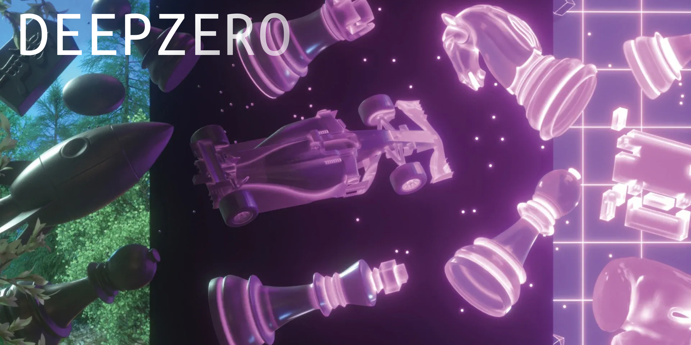

---


---
##### Ссылки

+ [репозиторий](https://github.com/Qwest1204/DeepZero)

---
**DeepZero** — реализация алгоритма обучения с подкреплением на основе AlphaZero для настольных игр. Нейросеть обучается играть в игры исключительно через самостоятельную игру (self-play), без использования человеческих знаний или заранее подготовленных баз данных.


## 🎯 Поддерживаемые игры

| Игра | Размер доски | Действия | Каналы | Сложность |
|------|--------------|----------|--------|-----------|
| ❌⭕ Крестики-нолики | 3×3 | 9 | 3 | ⭐ |
| 🔴🟡 Четыре в ряд | 6×7 | 7 | 3 | ⭐⭐ |
| ⚫⚪ Шашки | 8×8 | 4096 | 5 | ⭐⭐⭐ |
| ♟️♚ Шахматы | 8×8 | 4096 | 13 | ⭐⭐⭐⭐ |

## 🧠 Алгоритм

DeepZero использует комбинацию **глубокой нейронной сети** и **поиска по дереву Монте-Карло (MCTS)**.

### Архитектура

```
┌─────────────────────────────────────────────────────────────┐
│                      DeepZero                                │
├─────────────────────────────────────────────────────────────┤
│                                                              │
│   ┌─────────────┐      ┌─────────────┐      ┌────────────┐  │
│   │   Игровая   │ ───▶ │   ResNet    │ ───▶ │   MCTS     │  │
│   │    среда    │      │  (policy,   │      │  (поиск)   │  │
│   │             │ ◀─── │   value)    │ ◀─── │            │  │
│   └─────────────┘      └─────────────┘      └────────────┘  │
│                                                              │
└─────────────────────────────────────────────────────────────┘
```

### Компоненты

#### 1. 🎲 Игровые среды (`games/`)
Каждая игра реализует единый интерфейс:

```python
class Game:
    def get_initial_state(self)           # Начальное состояние
    def get_next_state(state, action, player)  # Применить ход
    def get_valid_moves(state)            # Маска допустимых ходов
    def check_win(state, action)          # Проверка победы
    def get_value_and_terminated(state, action)  # Значение и терминальность
    def change_perspective(state, player) # Смена перспективы
    def get_encoded_state(state)          # Кодирование для нейросети
```

#### 2. 🧬 Нейросеть ResNet (`models/resnet.py`)
Остаточная нейронная сеть с двумя головами:

```
Input: encoded_state [channels × height × width]
          │
          ▼
    ┌─────────────┐
    │ Conv Block  │
    └─────────────┘
          │
          ▼
    ┌─────────────┐
    │  ResBlocks  │ × N
    └─────────────┘
          │
    ┌─────┴─────┐
    ▼           ▼
┌────────┐ ┌────────┐
│ Policy │ │ Value  │
│  Head  │ │  Head  │
└────────┘ └────────┘
    │           │
    ▼           ▼
 π(s,a)       v(s)
```

- **Policy Head** `π(s,a)`: Вероятности действий
- **Value Head** `v(s)`: Оценка позиции [-1, 1]

#### 3. 🌳 MCTS (`models/mcts.py`)
Поиск по дереву Монте-Карло улучшает политику нейросети:

```
          Selection          Expansion         Simulation        Backpropagation
              │                  │                  │                   │
              ▼                  ▼                  ▼                   ▼
           ┌───┐              ┌───┐              ┌───┐              ┌───┐
           │ ● │──────────────│ ● │──────────────│ ● │──────────────│ ● │
           └─┬─┘              └─┬─┘              └─┬─┘              └─┬─┘
           ┌─┴─┐              ┌─┴─┐              ┌─┴─┐              ┌─┴─┐
           │   │              │   │              │   │              │   │
          ●   ●              ●   ●              ●   ●──▶NN        ●   ●
                                  │                  │                 ▲
                                  ▼                  ▼                 │
                                  ○              v=0.7 ────────────────┘
```

**UCB формула для выбора узла:**
```
UCB(s,a) = Q(s,a) + C × π(s,a) × √(N(s)) / (1 + N(s,a))
```

#### 4. 🔄 Self-Play (`models/deepzero.py`)
Цикл обучения:

```
┌─────────────────────────────────────────────────────────┐
│                    Итерация обучения                     │
├─────────────────────────────────────────────────────────┤
│                                                          │
│  1. Self-Play (генерация данных)                        │
│     ┌──────────────────────────────────────────┐        │
│     │  for game in parallel_games:             │        │
│     │      state = initial_state               │        │
│     │      while not terminated:               │        │
│     │          π = MCTS.search(state)          │        │
│     │          action = sample(π)              │        │
│     │          memory.append(state, π)         │        │
│     │          state = next_state(action)      │        │
│     │      assign_values(memory, winner)       │        │
│     └──────────────────────────────────────────┘        │
│                          │                               │
│                          ▼                               │
│  2. Training (обучение нейросети)                       │
│     ┌──────────────────────────────────────────┐        │
│     │  for epoch in epochs:                    │        │
│     │      for batch in memory:                │        │
│     │          π_pred, v_pred = model(states)  │        │
│     │          loss = CE(π_pred, π_target)     │        │
│     │                + MSE(v_pred, v_target)   │        │
│     │          optimizer.step()                │        │
│     └──────────────────────────────────────────┘        │
│                          │                               │
│                          ▼                               │
│  3. Save checkpoint                                      │
│                                                          │
└─────────────────────────────────────────────────────────┘
```
## 📊 Параметры

| Параметр | Описание | TicTacToe | Checkers | Chess |
|----------|----------|-----------|----------|-------|
| `num_resBlocks` | Количество residual блоков | 4 | 9 | 19 |
| `num_hidden` | Размер скрытого слоя | 64 | 128 | 256 |
| `num_searches` | MCTS симуляций за ход | 60 | 100 | 400 |
| `num_iterations` | Итераций обучения | 3 | 8 | 20 |
| `num_parallel_games` | Параллельных self-play игр | 100 | 32 | 64 |
| `dirichlet_alpha` | Параметр шума Дирихле | 0.3 | 0.5 | 0.3 |

## 📈 Результаты обучения

После обучения модель сохраняется в файлы:
- `model_{Game}_{iteration}.pt` — веса модели
- `optimizer_{Game}_{iteration}.pt` — состояние оптимизатора

## 🔧 API игровых сред

Все игры реализуют единый интерфейс:

```python
class Game:
    row_count: int          # Высота доски
    column_count: int       # Ширина доски
    action_size: int        # Размер пространства действий
    shape_obs: int          # Количество каналов для нейросети
    
    def __repr__(self) -> str
    def get_initial_state(self) -> np.ndarray
    def get_next_state(self, state, action, player) -> np.ndarray
    def get_valid_moves(self, state) -> np.ndarray
    def check_win(self, state, action) -> bool
    def get_value_and_terminated(self, state, action) -> Tuple[int, bool]
    def get_opponent(self, player) -> int
    def get_opponent_value(self, value) -> int
    def change_perspective(self, state, player) -> np.ndarray
    def get_encoded_state(self, state) -> np.ndarray
    def flip_action(self, action) -> int
```

## 📚 Литература

- [Mastering the Game of Go without Human Knowledge](https://www.nature.com/articles/nature24270) — AlphaGo Zero
- [A general reinforcement learning algorithm that masters chess, shogi, and Go](https://www.science.org/doi/10.1126/science.aar6404) — AlphaZero
- [Mastering Atari, Go, Chess and Shogi by Planning with a Learned Model](https://arxiv.org/abs/1911.08265) — MuZero


## 🤝 Вклад

Pull requests приветствуются! Для крупных изменений сначала откройте issue.

---

<p align="center">
  Made with ❤️ and 🧠
</p>